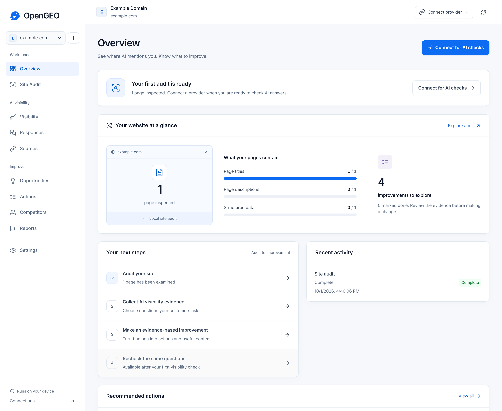

# OpenGEO

## Your GEO workspace. Powered by your ChatGPT plan.

Check AI answers, audit your sites and turn evidence into useful content. Run your AI visibility workflow locally with the ChatGPT plan you already have, or connect your own providers.

For site owners and agency operators: keep multiple websites, their evidence and improvement work in one open-source workspace on your computer.

**Audit -> Measure -> Diagnose -> Act -> Create -> Recheck.**



OpenGEO is free software. Your projects have no artificial limits, and no cloud account is required. External providers charge for their services.

**Development preview:** release downloads are not yet published. Distribution verification, managed provider jobs and the release confidentiality review must pass their launch gates before v1.

## Run locally

### Docker

Requires Docker with Compose. From a checkout:

```sh
node scripts/setup.mjs
docker compose up --build -d
```

Open <http://localhost:4318>. Keep the encryption secret private and preserve the Docker volume. If Node is unavailable, generate at least 32 random bytes into `.local/encryption-secret` using your operating system's secure random generator.

### Development

Requires Node.js 22 or newer:

```sh
npm ci
node scripts/setup.mjs
npm run build
```

Set `OPENGEO_SECRET_FILE` to the absolute path of `.local/encryption-secret`, then run `npm start`. The desktop build uses the operating-system credential store instead of this file. See [development](docs/development.md) for packaging and the frontend development server.

## A useful first session

1. Connect ChatGPT or your preferred provider. You can also choose local audits only.
2. Add your website. OpenGEO reads public pages and sitemaps locally, then uses your connected ChatGPT plan to suggest relevant customer questions. Edit, add or unselect individual questions.
3. Check your selected questions. Read the answers and citations, then choose which evidence-supported competitors to follow. Other paid connections require a spending approval before checks.
4. Track an improvement in Actions. Use your own expertise and audited sources to develop a brief and draft.
5. Review factual claims before publishing. Recheck the same questions, model and locale.

No rankings or growth are guaranteed. An observed change does not prove that a particular edit caused it.

## Connect only what you need

| Connection | Useful for | Cost and limits |
| --- | --- | --- |
| ChatGPT | ChatGPT API answer checks, analysis and content | Your eligible plan and granted permissions are required. Plan limits apply; no separate API key. Web search depends on model and account permissions. |
| SurfacedBy API | Managed checks and processed insights through one connection | Pay as you go with Console credits. Platform availability is verified when you connect. |
| DataForSEO + OpenRouter | Direct measurement with AI analysis and content | Both connections are needed for the full workflow. Each provider charges for its own usage. |
| OpenRouter | API answer checks, analysis and content with model selection | Your account pays the selected model's usage charges. OAuth and existing keys are supported. |

OpenGEO never silently switches to a paid provider. If access expires or a quota is reached, affected work pauses with its progress preserved. Reset times are shown only when supplied by the provider.

ChatGPT uses an independent implementation of the [published subscription-sharing protocol](https://developers.openai.com/siwc/token-sharing-open-source/). The example DevKit is not bundled. Eligibility and preview requirements can change. Self-hosted sign-in requires the browser to reach the callback on the host running OpenGEO; use a documented local connection or tunnel.

## Evidence you can inspect

Observations record the prompt, provider, model, locale, retrieval mode, collection time, answer and citation URLs. These are API measurements, which can differ from answers in a consumer application. ChatGPT checks can request web search; OpenRouter checks use model-only answers without a search plugin. Links are saved only when returned as citation annotations. Failed checks are missing observations, not absent mentions.

Mention rate is the percentage of collected answers detecting the configured brand or aliases. Citation rate is the percentage linking to the configured website. Local matching is literal; generic brand names need careful review. Console recognition and proprietary scores retain their own labels and provenance.

Content uses research, briefing, drafting, verification, editing and a final review of the edited article. Request a revision while retaining the original draft and its sources. Unresolved findings stay with the draft. Automated verification helps review; it does not replace a human checking factual claims. [Methodology](docs/methodology.md) explains the boundaries.

## Your installation, your data

SQLite stores projects and workflow progress locally. Provider credentials are encrypted separately and excluded from project exports. Optional usage sharing is preselected during new setup; you can uncheck it before finishing or turn it off in Settings. Existing choices are preserved. It shares activity counts with SurfacedBy without websites, prompts, content, account details or credentials. Selected provider calls send the task inputs needed for that operation. Crawling sends requests to your public website.

Draft edits are protected locally as you work. After a restart, choose whether to restore, export or discard them. Project exports contain saved drafts; save recovered edits before exporting a project.

Daily and weekly schedules persist across restarts. Desktop schedules run while the application remains open, including in the tray. Docker can operate continuously on your own host. Missed schedules coalesce into one fresh run. [Privacy and operations](docs/privacy.md).

## Contribute

Useful contributions include reproducible provider fixtures, clearer evidence views, audit rules with documented reasoning and accessibility improvements. Read [CONTRIBUTING.md](CONTRIBUTING.md) and [SECURITY.md](SECURITY.md). Original application code is MIT licensed; bundled dependency licenses remain applicable.

## Optional managed services

Keep working locally while connecting Console for managed measurement, or use [SurfacedBy](https://surfacedby.com) for hosted operation and collaboration. These are optional paths. Local exports remain available independently of a managed account.

### Credits

Maintained by SurfacedBy. Built with open-source libraries listed in [third-party notices](THIRD_PARTY_NOTICES.md).
